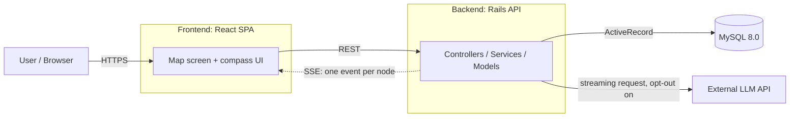
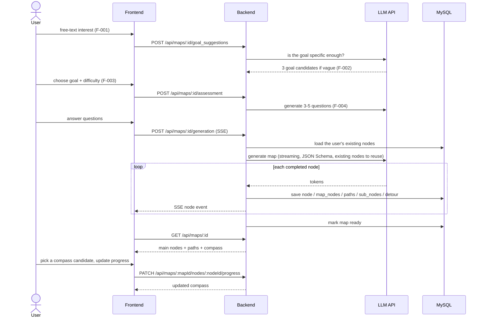

# Overall Architecture

Design as defined in `docs/basic_design.md` section 2 and `docs/design_doc.md` sections 3–4. Nothing below is implemented yet; when implementing, follow these decisions unless the design docs are updated first. Frontend and backend internals are in `frontend.md` and `backend.md`. Domain terms (マップ, ノード, 道, メインノード, サブノード, 寄り道, 元ノード, 既知ノード, …) follow `GLOSSARY.md`; decisions behind the model are in `docs/adr/`.

## System diagram

- The frontend talks only to the backend. Only the backend calls the LLM API and holds its key.
- Map generation is streamed: LLM tokens → backend buffers until one node is complete → save to DB → one SSE event to the frontend.

## Main flow (design_doc 3.2)

## Shared data model

The map is a DAG stored as relational node + path tables, not in a graph DB (`docs/design_doc.md` section 5.1). Nodes belong to the user and are shared across maps (ADR 0003):

- Shared: `nodes` (title, summary), `sub_nodes` + `sub_node_paths` (a node's contents), `progress_statuses` (one progress per node, plus `started_map_id`).
- Per map: `map_nodes` (which nodes are main nodes here, `importance_score`), `map_paths` (paths between main nodes), `detours` (max one per main node), `maps.current_node_id`, `maps.origin_node_id`.

Full table definitions: `docs/design_doc.md` section 4.1.2 (the source of truth; `docs/basic_design.md` section 4 is only an overview).

The map screen shows this graph as-is. There is **no linear roadmap view and no stored order** (`display_order` and the linearization algorithm were removed in design_doc v0.5.0). Do not reintroduce them.

## Concept: map + compass

The app's concept (and its name, Campass) is "spread out a map and check the compass": the map shows the whole graph for one goal, and a **compass** points from the learner's **current position** to **every node the learner can study now** (F-013, `docs/design_doc.md` section 4.2.8).

- The "map" is a metaphor only. Nodes have no coordinates; the map is drawn as a network graph.
- Current position is stored per map (`maps.current_node_id`): the main node last started or completed in that map; `null` is the start point.
- Compass candidates are derived each time, never stored: unfinished main nodes that are not known nodes, whose incoming paths all come from nodes that are completed or known. A known node is in progress in another map (`started_map_id` is another map) or completed.
- The compass guides; the learner may start any node, and completion is always the learner's decision (the system never auto-completes a node).

## Undecided

What happens when a user leaves during generation, frontend auth, and the details of F-016 / F-017 are still open (`docs/design_doc.md` section 9). Confirm with the user before implementing them.
