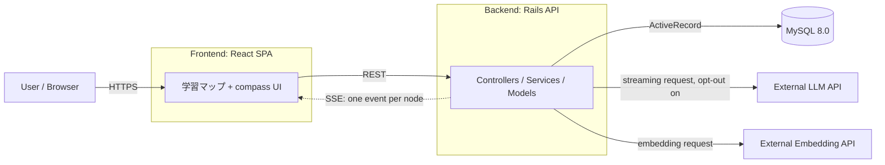
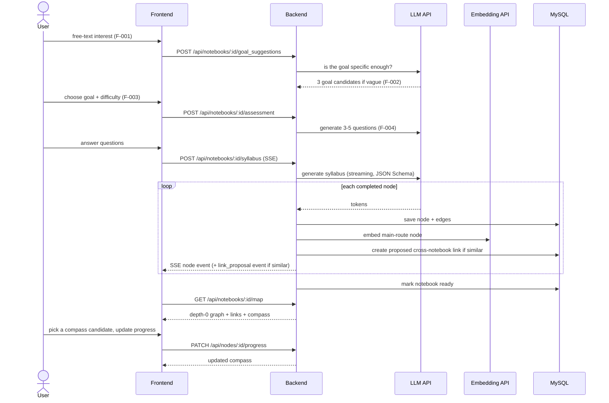

# Overall Architecture

Design as defined in `docs/basic_design.md` section 2 and `docs/design_doc.md` sections 3–4. Nothing below is implemented yet; when implementing, follow these decisions unless the design docs are updated first. Frontend and backend internals are in `frontend.md` and `backend.md`.

## System diagram

- The frontend talks only to the backend. Only the backend calls the LLM and Embedding APIs, and only the backend holds their API keys.
- Syllabus generation is streamed: LLM tokens → backend buffers until one node is complete → save to DB → one SSE event to the frontend.

## Main flow (design_doc 3.2)

## Shared data model

The syllabus is a DAG stored as relational node + edge tables, not in a graph DB (`docs/design_doc.md` section 5.1).

- `syllabus_nodes`: `route_type` (`main` / `sub`), `depth_level`, `parent_node_id`, `related_main_node_id`, `importance_score` (LLM-assigned, 0–1), `embedding` (main-route nodes only).
- `syllabus_edges`: prerequisite relations between nodes.
- `cross_notebook_links`: links between nodes in different notebooks of the same user, with status `proposed` / `accepted` / `rejected` and a unique constraint per node pair.

Full table definitions: `docs/design_doc.md` section 4.1.2 (the source of truth; `docs/basic_design.md` section 4 is only an overview).

The 学習マップ shows this graph as-is. There is **no linear roadmap view and no stored order** (`display_order` and the linearization algorithm were removed in design_doc v0.5.0). Do not reintroduce them.

## Concept: map + compass

The app's concept (and its name, Campass) is "spread out a map and check the compass": the 学習マップ shows the whole syllabus, and a **compass** points from the learner's **current position** to **every node the learner can study now** (F-013, `docs/design_doc.md` section 4.2.8).

- The "map" is a metaphor only. Nodes have no coordinates; the 学習マップ is drawn as a network graph.
- Current position = the `in_progress` node (latest `updated_at` if several); otherwise the most recently completed node (`completed_at`); otherwise none (start point).
- Compass candidates = incomplete main-route nodes whose `required` main-route prerequisites are all completed. All candidates are shown; the user chooses. `importance_score` only decides which candidate is highlighted.
- The compass is derived from `syllabus_edges` + `progress_statuses` each time. It is not stored.
- `sub` nodes (寄り道) are never the current position or the compass target.

## Undecided

The screen flow for the 学習マップ and for presenting cross-notebook-link proposals, and what happens when a user leaves during generation, are still undecided (`docs/design_doc.md` section 9). Confirm with the user before implementing them.
