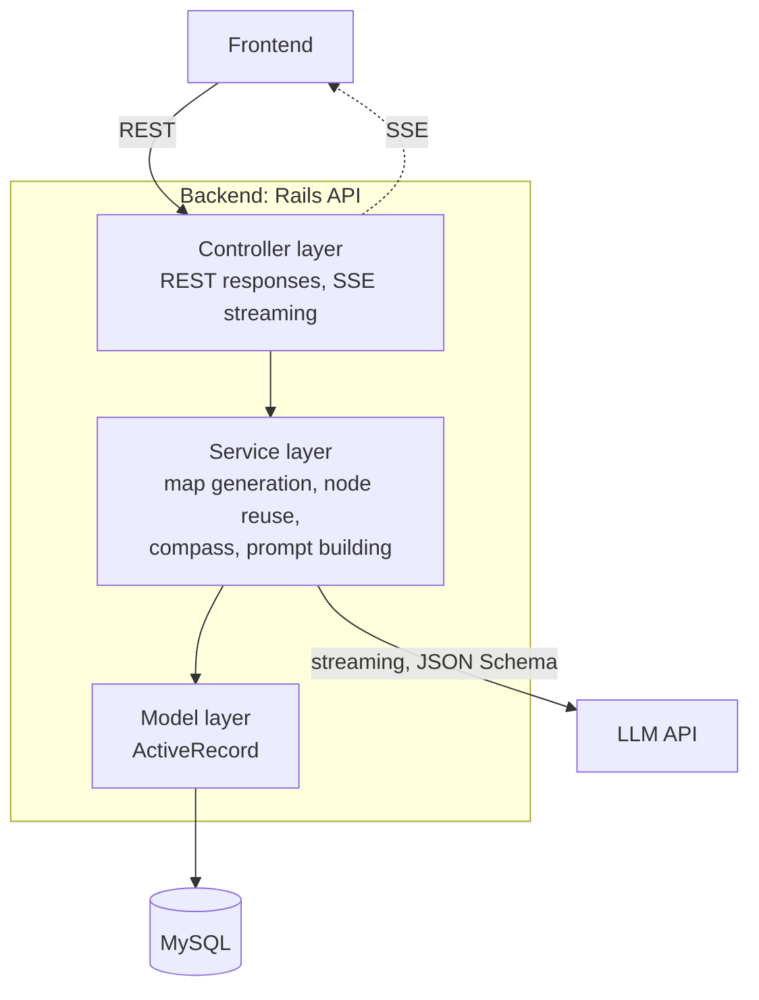
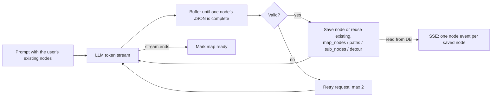

# Backend Architecture

Ruby on Rails 7.1 in API mode. Design from `docs/basic_design.md` section 2.3 and `docs/design_doc.md` sections 4.2–4.3. Not implemented yet (no Rails app has been generated).

## Layers

| Layer | Responsibility |
| :--- | :--- |
| Controller | Accepts API requests and returns normal or SSE responses. No business logic. |
| Service | Business logic and all LLM API calls. |
| Model | MySQL access through ActiveRecord. |

## Map generation pipeline

The pipeline runs in a background job (ActiveJob `:async`) started by `POST /api/maps`, not in the SSE request, so it continues when the client disconnects (`docs/design_doc.md` section 4.2.9, ADR 0004):

- Save one node per transaction. Lock the `maps` row first (`SELECT … FOR UPDATE`); if the map is gone, close the LLM stream, log, and stop quietly; if it is no longer `generating`, stop without saving. Update `maps.generation_heartbeat_at` after each save.
- On an exception, set `status = failed` and `generation_error_code`. Log the details; never store the exception message.
- A `generating` map whose heartbeat is older than the limit (5 minutes to start with) is set to `failed` / `timed_out` by the SSE loop and by map-reading APIs.
- The SSE controller never receives nodes from the job. On every connection it sends all saved nodes, then polls the DB for new ones, and ends with `done`, `error` or `deleted`.

See `llm-integration.md` for LLM call rules and `../meta/error.md` for failure handling.

## API endpoints

Defined in `docs/design_doc.md` section 4.3.1 (response examples are there too).

| Endpoint | Purpose |
| :--- | :--- |
| `GET /api/maps` / `POST /api/maps` | List / create maps (F-012). `POST` takes the goal, difficulty, and `origin_node_id` or `detour_id` (F-017, F-006), creates the map as `generating` and starts the generation job (F-011). |
| `DELETE /api/maps/:id` / `GET /api/maps/:id/deletion_preview` | Delete a map (also while `generating`; locks the `maps` row first) / preview what deletion affects. |
| `POST /api/goal_suggestions` | Goal candidates for vague input (F-002). Called before the map exists. |
| `GET /api/maps/:id/generation` (SSE) | Watch generation (F-011): all saved nodes as `node` events, then new ones, then `done`, `error` or `deleted`. Reconnectable; no `Last-Event-ID`. |
| `GET /api/maps/:id` | `status` and `error`, main nodes, paths, detour entrances, origin links, and `compass` (only when `ready`). |
| `GET /api/maps/:mapId/nodes/:nodeId` | Node detail: summary, progress, this map's detour, other maps it appears in. |
| `GET /api/nodes/:id/sub_nodes` | Drill-down (F-007): sub nodes and the paths among them (shared, no map). |
| `PATCH /api/maps/:mapId/nodes/:nodeId/progress` | Update progress (F-010); appends a `map_progress_events` row for that map and updates `started_map_id`; returns `compass` and `origin_completion_suggestion`. |
| `GET /api/nodes?q=&map_id=` | Existing-node suggestions for editing (F-018): the user's nodes whose title matches, with `already_main` and `inside` for that map. |
| `POST` / `PATCH` / `DELETE /api/maps/:mapId/nodes[/:nodeId]`, `POST` / `DELETE /api/maps/:mapId/paths` | Map edits (F-018): place or remove a main node, change importance, add or remove a path. Return the same body as `GET /api/maps/:id`. |
| `PATCH /api/nodes/:id`, `POST` / `DELETE /api/nodes/:id/sub_nodes`, `POST` / `DELETE /api/nodes/:id/sub_node_paths` | Shared edits (F-018): title and summary, sub nodes, paths among sub nodes. Take the acting `map_id`. |

## Core algorithms

- **No linearization.** `display_order` and the topological-sort step were removed (F-005, F-008 are 廃止). Do not add a stored order.
- **Node reuse (F-015, design_doc 4.2.4)**: send the user's existing nodes (with their sub nodes) to the LLM; it reuses them by ID instead of creating duplicates, and may add sub nodes to a reused node. For a map made from an origin node, its new main nodes also become sub nodes of the origin node. Never reuse another user's nodes.
- **Compass (F-013, design_doc 4.2.8)**: over the map's main nodes, recomputed on every progress update, never stored.
  - Current position: derived from `map_progress_events` of that map (ADR 0005). For each placement (`map_node_id` not NULL) take the latest event; drop `reset`; the newest remaining `started` / `completed` is the current position. Events are only added by progress updates made from that map, and are never deleted when a node is removed.
  - Known node: `completed`, or `in_progress` with `started_map_id` set to another map (`NULL` counts as this map).
  - Candidates: not completed, not known, and every incoming `map_paths` source is completed or known. Sort by `importance_score` desc, then `id`. Return all of them.
  - Goal reached: at least one main node and every main node completed (an empty map is never goal reached); return `is_goal_reached: true` and empty `candidates`. Never auto-complete the origin node; return a suggestion instead.
  - Sub node progress is recorded but ignored by the compass.
- **Drill-down (F-007)**: sub nodes come from `sub_nodes` and are the same in every map.
- **Difficulty (F-003)**: ライト / スタンダード / ディープ map to `max_depth` and `node_count_target`.
- **Map deletion**: cascade `map_nodes`, `map_paths`, `detours`, `map_progress_events`; delete a node only when no map and no node references it.
- **Editing (F-018, design_doc 4.2.10)**: only from a `ready` map (`409 map_not_ready`); lock the `maps` row first. Reject edits that make `map_paths`, `sub_node_paths` or `sub_nodes` cyclic with `422 cycle` and the cycle; never fix them silently. Removing a main node deletes its paths and detour (no rewiring), sets its events' `map_node_id` to NULL, and deletes nodes left unreferenced by the map-deletion rule. Edits that reach other maps or delete nodes with progress return `409 confirmation_required` until resent with `confirmed=true`. Importance high / mid / low is stored as 0.9 / 0.5 / 0.1. In a map made from an origin node, placing or removing a main node also changes the origin node's sub nodes.
