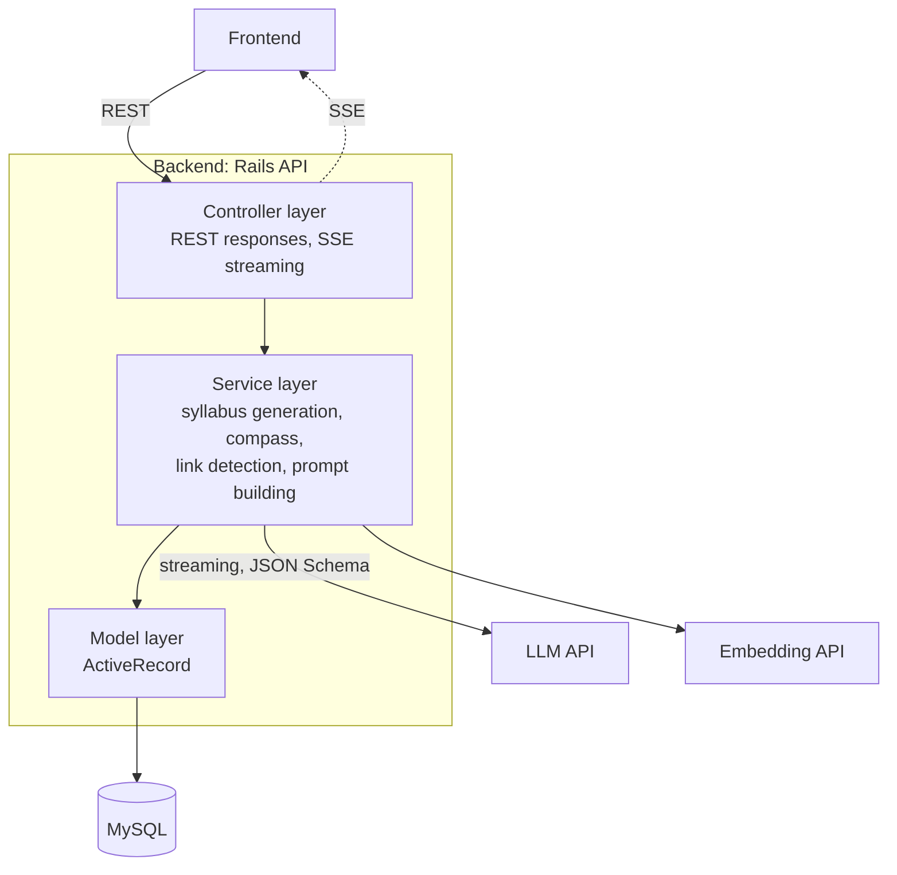
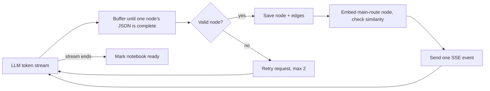

# Backend Architecture

Ruby on Rails 7.1 in API mode. Design from `doc/basic_design.md` section 2.3 and `doc/design_doc.md` sections 4.2–4.3. Not implemented yet (no Rails app has been generated).

## Layers

| Layer | Responsibility |
| :--- | :--- |
| Controller | Accepts API requests and returns normal or SSE responses. No business logic. |
| Service | Business logic and all external API calls (LLM, Embedding). |
| Model | MySQL access through ActiveRecord. |

## Syllabus generation pipeline

See `llm-integration.md` for LLM call rules and `../meta/error.md` for failure handling.

## API endpoints

Defined in `doc/design_doc.md` section 4.3.1 (response examples are there too).

| Endpoint | Purpose |
| :--- | :--- |
| `POST /api/notebooks` | Create a notebook. |
| `POST /api/notebooks/:id/goal_suggestions` | Goal candidates for vague input (F-002). |
| `POST /api/notebooks/:id/assessment` | Get / answer prerequisite questions (F-004). |
| `POST /api/notebooks/:id/syllabus` (SSE) | Start streaming generation; one `node` event per node, a separate `link_proposal` event right after it if similar, then `done` or `error` (F-011). |
| `GET /api/notebooks/:id/map` | `depth_level = 0` graph for the 学習マップ, including accepted cross-notebook links and `compass`. |
| `GET /api/nodes/:id/children` | Drill-down (F-007): child nodes of a node and the edges between them. |
| `GET /api/cross_notebook_links?status=proposed` | Pending link proposals. |
| `PATCH /api/cross_notebook_links/:id` | Accept / reject a proposal. |
| `PATCH /api/nodes/:id/progress` | Update node progress (F-010); returns the updated `compass`. |

## Core algorithms

- **No linearization.** `display_order` and the topological-sort step were removed (F-005, F-008 are 廃止). Do not add a stored order. `sub` nodes attach to a main node through `related_main_node_id` (F-006).
- **Compass (F-013, design_doc 4.2.8)**: decided in the backend over `depth_level = 0` main-route nodes, recomputed on every progress update, never stored.
  - Current position: the `in_progress` node with the latest `updated_at`; else the node with the latest `completed_at`; else `null` (start point).
  - Candidates: every incomplete node whose prerequisites via `relation_type = 'required'` edges (main-route only) are all completed. `in_progress` nodes are included. Sort by `importance_score` desc, then `id`. Return all of them.
  - If every node is completed, return `is_goal_reached: true` and empty `candidates`.
  - `sub` nodes and `supplementary` edges are ignored.
- **Drill-down (F-007)**: children are found by `parent_node_id` and returned as a graph (nodes + edges among them).
- **Difficulty (F-003)**: ライト / スタンダード / ディープ map to prompt limits such as `max_depth`.
- **Cross-notebook links (design_doc 4.2.7)**: compare embeddings of main-route nodes against the same user's other notebooks. Pairs at or above the threshold (provisionally 0.80, kept conservative) become `proposed`. Never compare against other users' nodes, never create a duplicate pair, and never propose a rejected pair again.
