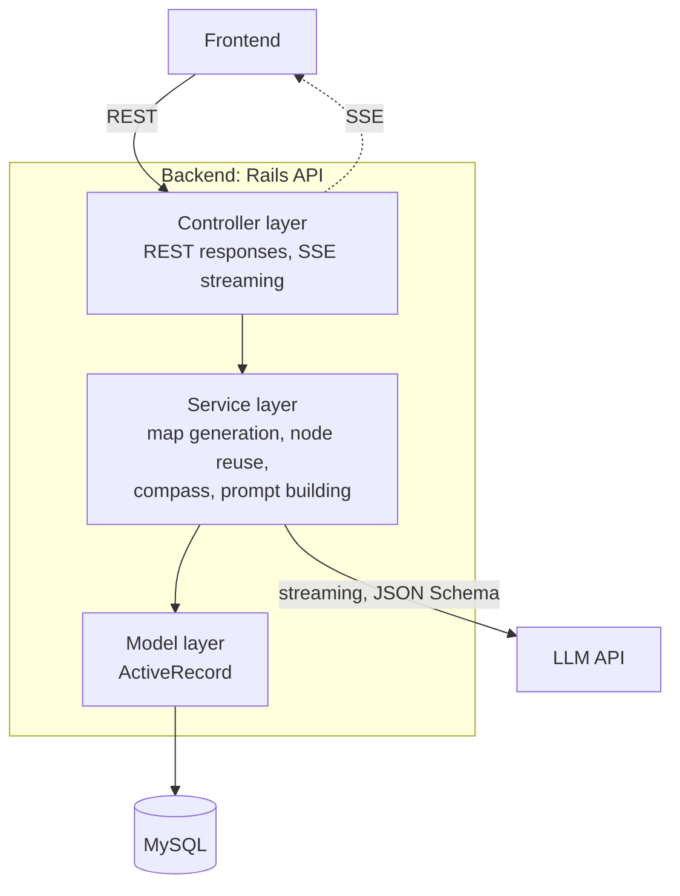
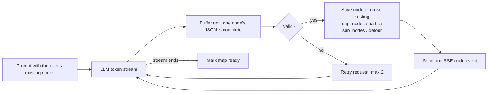

# Backend Architecture

Ruby on Rails 7.1 in API mode. Design from `docs/basic_design.md` section 2.3 and `docs/design_doc.md` sections 4.2–4.3. Not implemented yet (no Rails app has been generated).

## Layers

| Layer | Responsibility |
| :--- | :--- |
| Controller | Accepts API requests and returns normal or SSE responses. No business logic. |
| Service | Business logic and all LLM API calls. |
| Model | MySQL access through ActiveRecord. |

## Map generation pipeline

See `llm-integration.md` for LLM call rules and `../meta/error.md` for failure handling.

## API endpoints

Defined in `docs/design_doc.md` section 4.3.1 (response examples are there too).

| Endpoint | Purpose |
| :--- | :--- |
| `GET /api/maps` / `POST /api/maps` | List / create maps (F-012). `POST` takes `origin_node_id` or `detour_id` (F-017, F-006). |
| `DELETE /api/maps/:id` / `GET /api/maps/:id/deletion_preview` | Delete a map / preview what deletion affects. |
| `POST /api/maps/:id/goal_suggestions` | Goal candidates for vague input (F-002). |
| `POST /api/maps/:id/generation` (SSE) | Start streaming generation; one `node` event per node, then `done` or `error` (F-011). |
| `GET /api/maps/:id` | Main nodes, paths, detour entrances, origin links, and `compass`. |
| `GET /api/maps/:mapId/nodes/:nodeId` | Node detail: summary, progress, this map's detour, other maps it appears in. |
| `GET /api/nodes/:id/sub_nodes` | Drill-down (F-007): sub nodes and the paths among them (shared, no map). |
| `PATCH /api/maps/:mapId/nodes/:nodeId/progress` | Update progress (F-010); updates the map's current position and `started_map_id`; returns `compass` and `origin_completion_suggestion`. |

## Core algorithms

- **No linearization.** `display_order` and the topological-sort step were removed (F-005, F-008 are 廃止). Do not add a stored order.
- **Node reuse (F-015, design_doc 4.2.4)**: send the user's existing nodes (with their sub nodes) to the LLM; it reuses them by ID instead of creating duplicates, and may add sub nodes to a reused node. For a map made from an origin node, its new main nodes also become sub nodes of the origin node. Never reuse another user's nodes.
- **Compass (F-013, design_doc 4.2.8)**: over the map's main nodes, recomputed on every progress update, never stored.
  - Current position: `maps.current_node_id`, set when a main node is started or completed in that map.
  - Known node: `completed`, or `in_progress` with `started_map_id` set to another map (`NULL` counts as this map).
  - Candidates: not completed, not known, and every incoming `map_paths` source is completed or known. Sort by `importance_score` desc, then `id`. Return all of them.
  - Goal reached: every main node completed; return `is_goal_reached: true` and empty `candidates`. Never auto-complete the origin node; return a suggestion instead.
  - Sub node progress is recorded but ignored by the compass.
- **Drill-down (F-007)**: sub nodes come from `sub_nodes` and are the same in every map.
- **Difficulty (F-003)**: ライト / スタンダード / ディープ map to `max_depth` and `node_count_target`.
- **Map deletion**: cascade `map_nodes`, `map_paths`, `detours`; delete a node only when no map and no node references it.
