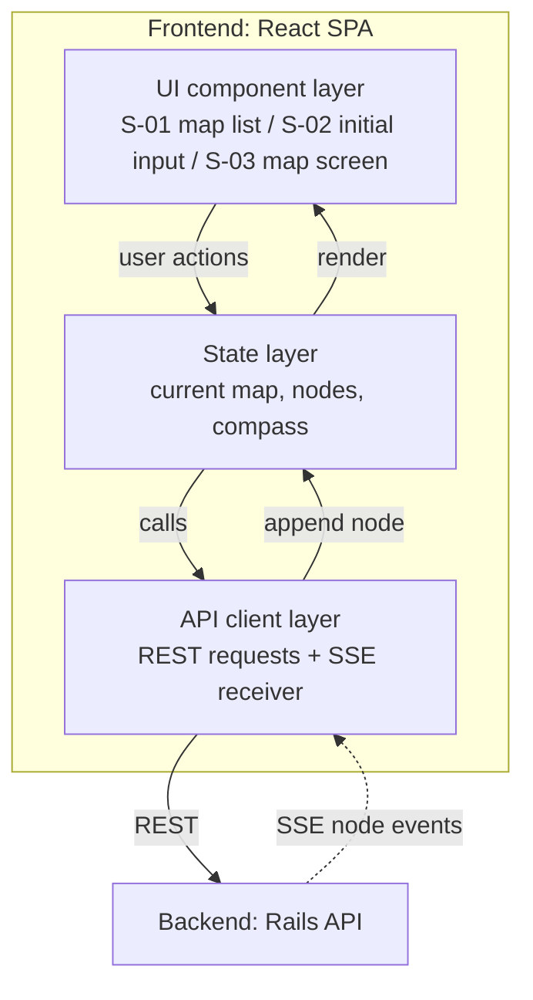
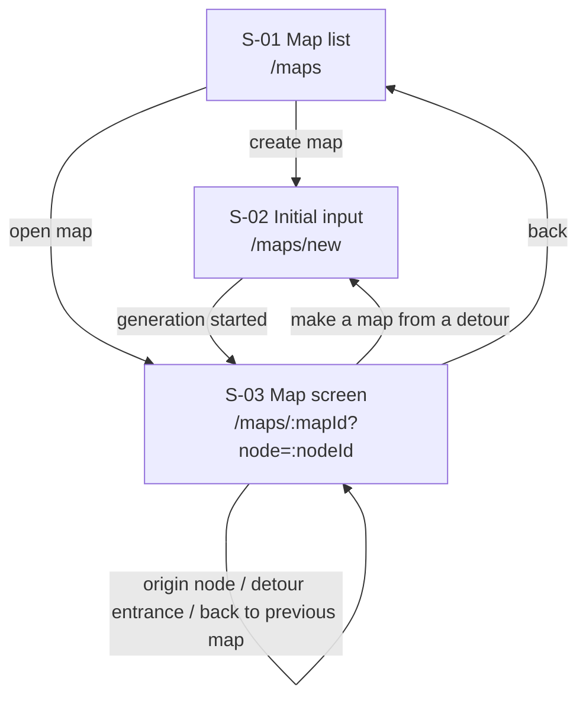

# Frontend Architecture

React SPA. Design from `docs/basic_design.md` sections 2.2 and 3, and `docs/design_doc.md` section 4.4. Not implemented yet; the directory layout and libraries (router, state management, graph rendering) are not chosen. Ask the user before adding any npm package.

## Layers

| Layer | Responsibility |
| :--- | :--- |
| UI components | Screens and user input. Never calls the backend directly. |
| State | App state shared across screens (current map, nodes, compass). |
| API client | All backend communication, including receiving the SSE stream for map generation. |

## Screens

Details: `docs/design_doc.md` section 4.4.

## Rules

- **There is no linear roadmap view.** Do not build one, and do not sort nodes into a single order on the client.
- **Render streamed nodes one at a time.** S-02 calls `POST /api/maps` (creates the map and starts generation) and moves to S-03 at once. S-03 connects to `GET /api/maps/:id/generation`. Each SSE `node` event carries one complete node; store nodes keyed by ID (upsert, since every connection resends all saved nodes) and draw it immediately. If the connection drops without a terminal event, reconnect with the same `GET`; generation keeps running on the backend. Reused nodes arrive already filled in (F-009). Show the compass only after `done`.
- **Generation status**: on opening S-03, branch on `status` from `GET /api/maps/:id`: `generating` → draw saved nodes and connect to the SSE, no compass; `failed` → draw saved nodes, no compass, show an amber warning icon with `error.message` and a delete button (delete and make again; no retry in place). Only S-02 starts generation. In S-01, show a spinner for `generating` and the amber warning icon for `failed`, each with an `aria-label` (「作成中」「作成に失敗」) and no visible text badge.
- **Map screen**: first draw only main nodes, with titles and paths only (no `summary` until a node is selected). Center the initial view on the current position and its surroundings. Selecting a node opens the detail panel (`GET /api/maps/:mapId/nodes/:nodeId`) and keeps the selection in `?node=`.
- **Drill-down (F-007)**: fetch `GET /api/nodes/:id/sub_nodes` and expand the sub nodes as a graph inside that node. For an origin node, move to its map instead.
- **Marks**: shared nodes get a "common with other maps" mark; origin nodes a "has a map inside" mark. A detour without a map appears only in the detail panel; once a map is made from it, draw a dashed dead-end entrance from its main node. Detour entrances have no progress.
- **Navigation between maps**: browser back plus a "← back to previous map" link. No breadcrumb (shared nodes give a map several parents).
- **Compass**: mark the current position (none = start point) and point at every candidate. Use `compass` (`current_node_id`, `candidates` sorted by `importance_score`, `is_goal_reached`) from the backend as-is; never derive it on the client. Highlight the first candidate. Any node can be started, not only candidates. After a progress update, use the `compass` returned by `PATCH /api/maps/:mapId/nodes/:nodeId/progress`; if it returns `origin_completion_suggestion`, ask whether to complete the origin node.
- **First visit**: on the user's first S-03 only, show three skippable hints (current position, compass, select a node).
- **Map deletion**: show `GET /api/maps/:id/deletion_preview` first and warn that nodes started in this map stay in progress in the other maps. A `generating` map can be deleted too; add 「作成中です．削除すると作成も止まります」 to the confirmation. After deleting in this tab, go to S-01 silently. A map deleted elsewhere (other tab, CLI) is noticed by the SSE `deleted` event, a `404`, or by diffing the map list against the previous one (on showing the list and on tab focus; no polling); go to S-01 and show one notice listing all such maps (`docs/design_doc.md` section 4.4).
- The frontend never holds or receives the LLM API key.
