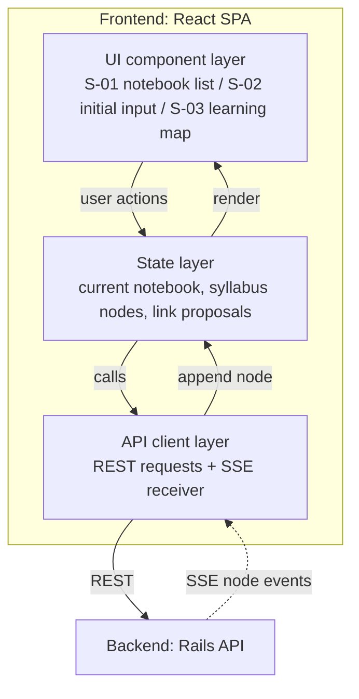
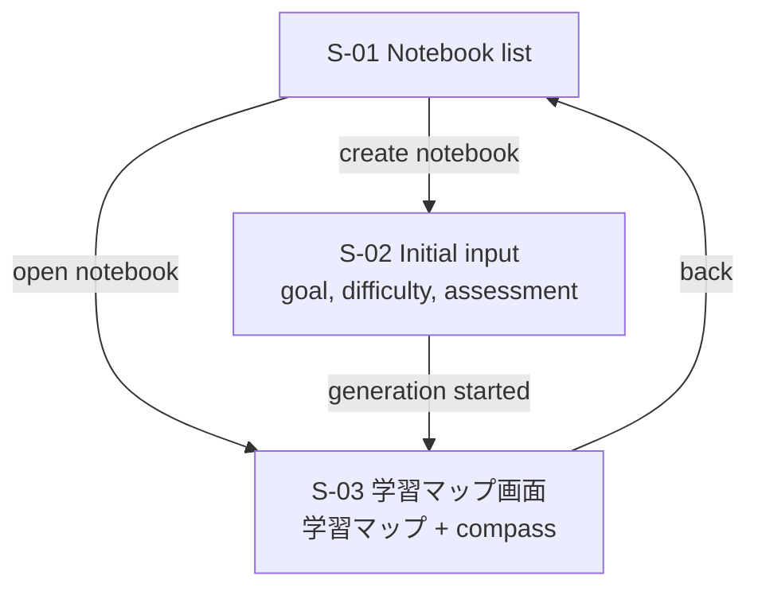

# Frontend Architecture

React SPA. Design from `doc/basic_design.md` sections 2.2 and 3, and `doc/design_doc.md` section 4.4. Not implemented yet; the directory layout and libraries (router, state management, graph rendering) are not chosen. Ask the user before adding any npm package.

## Layers

| Layer | Responsibility |
| :--- | :--- |
| UI components | Screens and user input. Never calls the backend directly. |
| State | App state shared across screens (current notebook, syllabus data, pending proposals). |
| API client | All backend communication, including receiving the SSE stream for syllabus generation. |

## Screens

## Rules

- **There is no linear roadmap view.** Do not build one, and do not sort nodes into a single order on the client.
- **Render streamed nodes one at a time.** Each SSE event carries one complete node; add it to state and draw it immediately, so the user can start reading before generation ends.
- **学習マップ**: first draw only `depth_level = 0` nodes, with titles and connections only (no `summary` until a node is selected). Center the initial view on the current position and its surroundings (its prerequisites and the compass candidates). Sub nodes are drawn as side paths from their main node (F-006). Accepted cross-notebook links get a visual mark.
- **Drill-down (F-007)**: selecting a node fetches `GET /api/nodes/:id/children` and expands its children as a graph inside that node.
- **F-009**: when a new chapter starts, animate a path from already-learned nodes to the new node.
- **Compass**: on the 学習マップ, mark the current position (none = start point) and point at every candidate. Use `compass` (`current_node_id`, `candidates` sorted by `importance_score`, `is_goal_reached`) from the backend as-is; do not work it out on the client. Highlight the first candidate. Selecting a candidate shows its details and lets the user start it (`in_progress`). After a progress update, use the `compass` returned by `PATCH /api/nodes/:id/progress`. When `is_goal_reached` is true, show the goal-reached state.
- A `proposed` link must look clearly unconfirmed until the user accepts it. Proposals must not block the 学習マップ.
- The frontend never holds or receives LLM / Embedding API keys.
