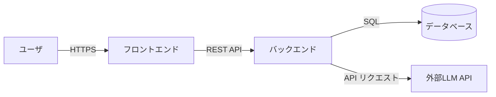
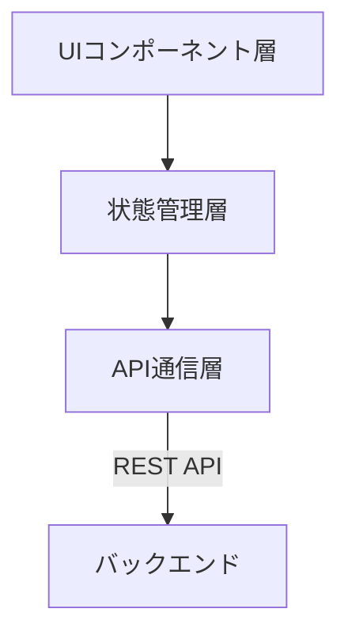
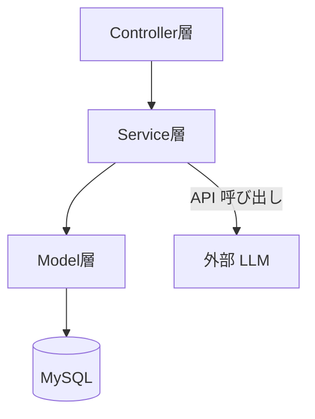
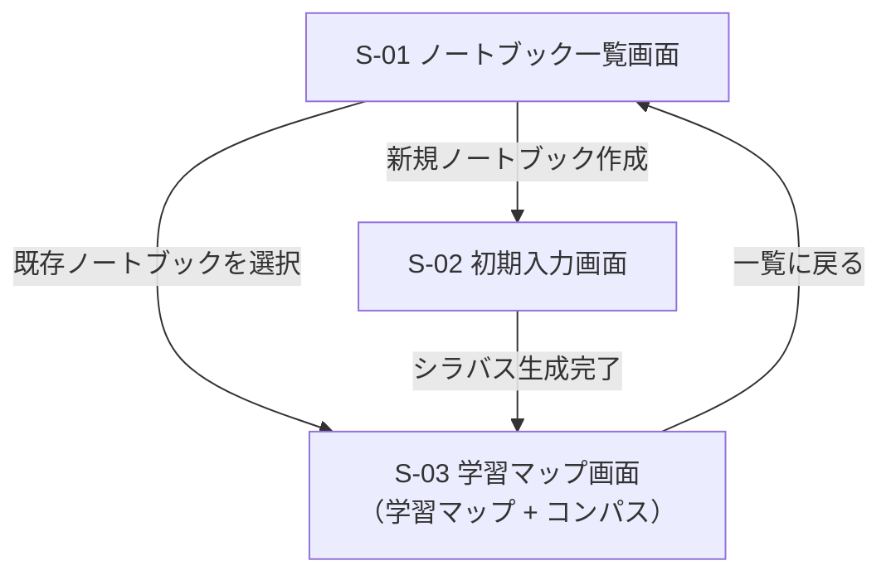
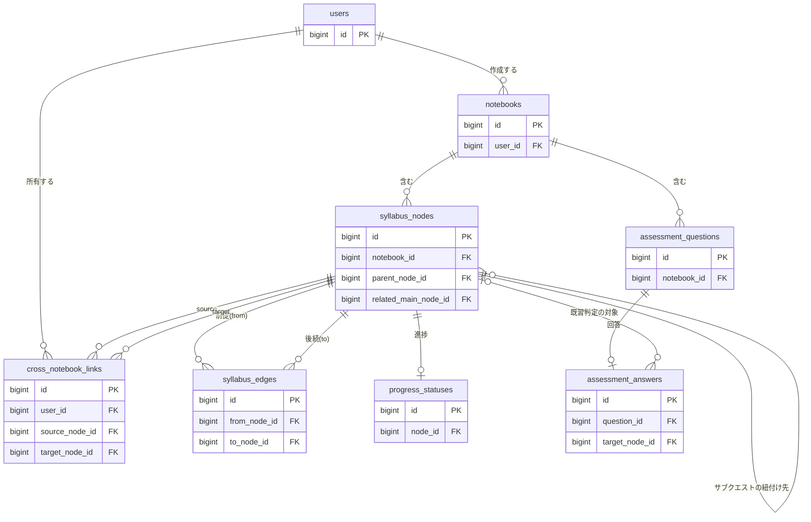

# 基本設計書：Campass

## 1. 文書概要

### 1.1 本書の位置づけ

本書は，「要件定義書（ReqDef.md）」に定義された機能要件・非機能要件を実現するための基本設計を定めるものである．
システム全体のアーキテクチャ，画面設計，データベース設計，および外部インターフェース（LLM API連携）設計について記載する．

### 1.2 改訂履歴

| バージョン | 日付 | 概要 | 変更者 |
| :--- | :--- | :--- | :--- |
| v1.0.0 | 2026/07/13 | 新規作成 | 池田 琉俊 |
| v1.1.0 | 2026/10/06 | 星座型ビューを「学習マップ」に改称し，コンパス（F-013）を画面設計に追加 | 池田 琉俊 |
| v1.2.0 | 2026/10/06 | 一本道ビューを廃止し，S-03 を学習マップのみの画面に変更．syllabus_nodes の order_index を廃止し importance_score を追加 | 池田 琉俊 |
| v1.3.0 | 2026/10/06 | 4章を概要（ER図・テーブル一覧）のみとし，カラム定義は Design Doc 4.1.2 を正とする形に変更（`syllabus_edges`，`progress_statuses`，アセスメント関連テーブルを ER図に追加）．5.1 のストリーミング方式を SSE に統一 | 池田 琉俊 |

---

## 2. システム構成

### 2.1 全体構成

| サブシステム | 役割 |
| :--- | :--- |
| フロントエンド | React によるSPA．学習マップ（コンパス付き）などのUIを担当． |
| バックエンド | Ruby on Rails によるAPIサーバー．LLM APIキーの秘匿管理，シラバスデータの生成・永続化を担当． |
| データベース | MySQL．ノートブック，シラバスノード，ユーザー進捗等を永続保持． |
| 外部LLM API | シラバスJSONの動的生成を担当．APIキーはバックエンドのみで保持し，フロントエンドには露出させない． |

以降の2.2・2.3では，上記サブシステムのうち「フロントエンド」「バックエンド」それぞれの内部レイヤー構成を示す．

### 2.2 フロントエンド構成

| レイヤー | 役割 |
| :--- | :--- |
| UIコンポーネント層 | 画面表示・ユーザー操作の受付．ノートブック一覧，初期入力，学習マップ等の各画面を構成する． |
| 状態管理層 | 画面をまたいで参照するアプリケーション状態（現在のノートブック，シラバスデータ等）を保持・更新する． |
| API通信層 | バックエンド API へのリクエスト送信，およびストリーミングレスポンス（シラバス逐次生成）の受信を担当する． |

### 2.3 バックエンド構成

| レイヤ | 役割 |
| :--- | :--- |
| Controller層 | フロントエンドからのAPIリクエストを受け付け，レスポンス（通常/ストリーミング）を返却する． |
| Service層 | シラバス生成・クロスノートブック類似度計算等のビジネスロジックを担当し，外部LLM API・Embedding APIとの連携を行う． |
| Model層 | ActiveRecordを通じてMySQLとのデータ入出力を担当する． |

---

## 3. 画面設計

### 3.1 画面一覧

| 画面ID | 画面名 | 概要 | 関連機能ID |
| :--- | :--- | :--- | :--- |
| S-01 | ノートブック一覧画面 | ユーザーが保持する複数の学習テーマ（ノートブック）を一覧表示し，新規作成・選択を行う． | F-012 |
| S-02 | 初期入力画面 | 興味・ゴールの入力，ゴール候補の選択，難易度選択，前提知識アセスメントを行う． | F-001〜F-004 |
| S-03 | 学習マップ画面 | LLMが生成したシラバスを表示する画面．シラバスノードをネットワーク図（学習マップ）として可視化し，現在地と，コンパスで今進める場所を指し示す．メイン/サブルートの表示の切り分けと，地点のドリルダウン展開に対応する． | F-006，F-007，F-009，F-010，F-013，非機能要件5.2 |

### 3.2 画面項目定義

### 3.3 画面遷移図

### 3.4 ワイヤーフレーム

---

## 4. データベース設計

本章ではテーブル間の関係の概要のみを示す．カラム・型・制約の定義は Design Doc（`design_doc.md`）4.1.2 を正とし，本書では重複して定義しない．

### 4.1 ER図

主キー・外部キーのみを示す．

### 4.2 テーブル一覧

| テーブル | 役割 | 関連機能 |
| :--- | :--- | :--- |
| `users` | ユーザー情報と認証 | — |
| `notebooks` | 学習テーマごとの作業スペース．ゴール・難易度・生成状態を持つ | F-001〜F-003，F-012 |
| `syllabus_nodes` | シラバスのノード（学習マップ上の地点） | F-006，F-007，F-011，F-013 |
| `syllabus_edges` | ノード間の前提関係（学習マップ上の道）．同一ノートブック内のみ | F-011，F-013 |
| `progress_statuses` | ノードごとの進捗．現在地とコンパスの決定に使う | F-010，F-013 |
| `cross_notebook_links` | 他ノートブックのノードとの関連の提案・承認状態 | 4.2.7（Design Doc） |
| `assessment_questions` / `assessment_answers` | 前提知識アセスメントの質問と回答 | F-004 |

---

## 5. 外部インターフェース設計

### 5.1 シラバス生成API連携

* ユーザーが確定した「ゴール」「難易度」「前提知識アセスメント結果」を基に，バックエンドが外部LLM APIへプロンプトを送信し，構造化されたシラバスJSONを生成する．
* シラバス生成には数十秒を要する可能性があるため，**ストリーミング形式**でLLMのレスポンスを逐次受信し，生成された章・ノードから順にフロントエンドへ反映する．
* バックエンドはストリーミングされたチャンクを解析し，ノード1件分のJSONが確定するたびに SSE（Server-Sent Events）でフロントエンドへ逐次配信する（Design Doc 4.3.2）．

### 5.2 Embedding API連携

* クロスノートブックのリンク提案機能のため，メインルートの `syllabus_nodes` 生成時にバックエンドが外部Embedding APIを呼び出し，各ノードの `embedding` を取得・保存する．
* 新規ノード追加時，既存の他ノートブックのメインルートノードとコサイン類似度を計算し，一定の閾値（暫定0.80）を超えたペアを `cross_notebook_links`（status: proposed）として登録する．

### 5.3 APIキー管理方式

* 外部LLM API・Embedding APIのキーは環境変数等によりバックエンド（Rails）側でのみ保持し，フロントエンドへは一切露出させない．
* フロントエンドから外部APIへの直接リクエストは行わず，必ずバックエンドを経由する構成とする．

### 5.4 オプトアウト設定

* 外部LLM API・Embedding APIへのリクエスト時には，送信データをAIモデルの学習に利用しない設定（オプトアウト）を必須パラメータとしてリクエストに含める．
* ユーザーの自由記述入力（ゴール入力等）に個人情報・秘密情報が含まれた場合の漏洩リスクを低減する．
