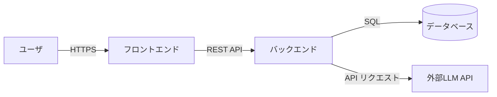
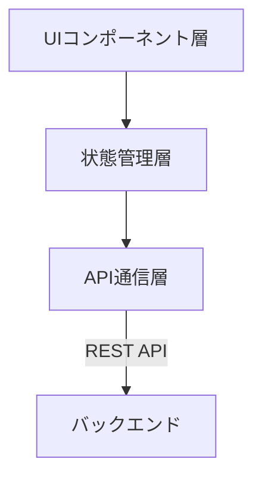
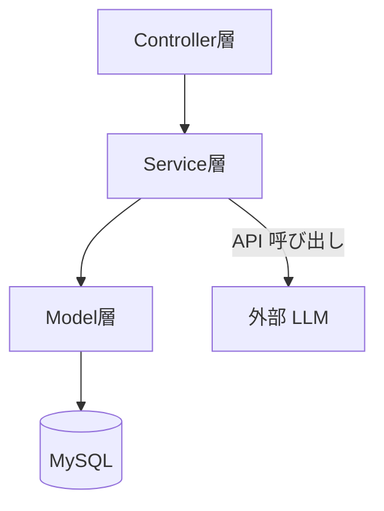
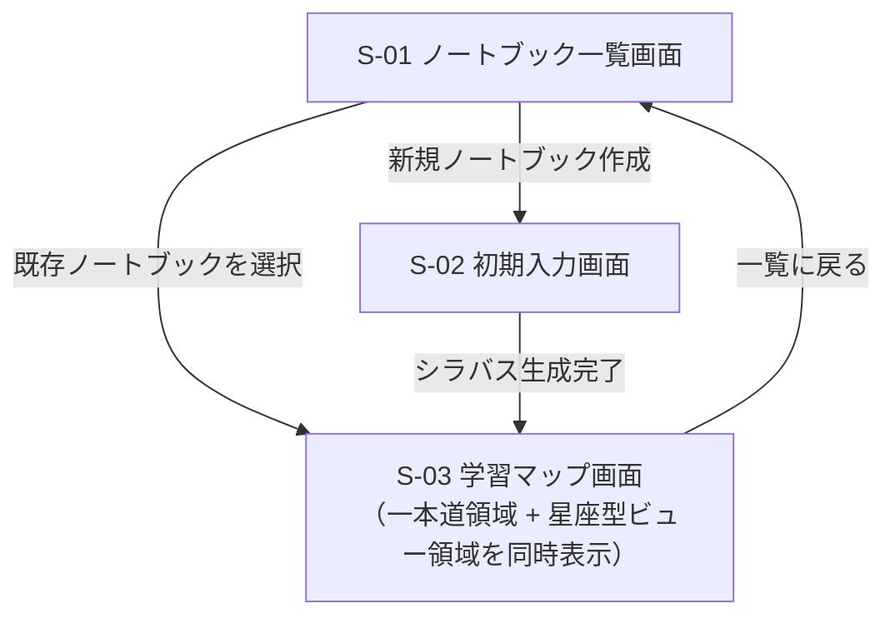
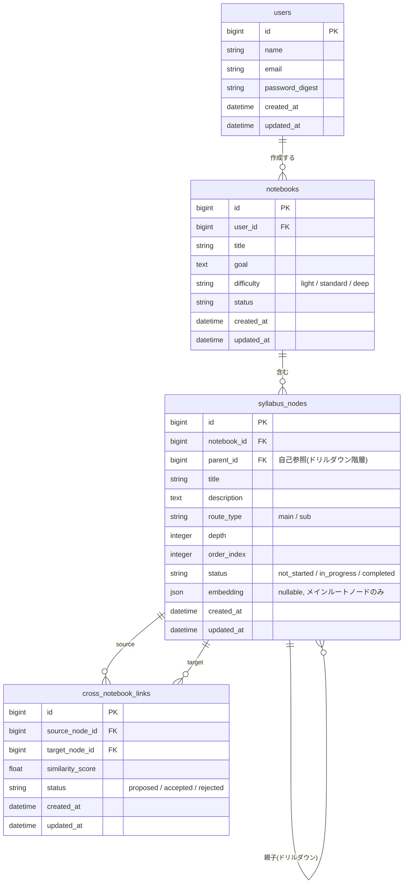

# 基本設計書：学習プロセス提案アプリ（仮称）

## 1. 文書概要

### 1.1 本書の位置づけ

本書は，「要件定義書（ReqDef.md）」に定義された機能要件・非機能要件を実現するための基本設計を定めるものである．
システム全体のアーキテクチャ，画面設計，データベース設計，および外部インターフェース（LLM API連携）設計について記載する．

### 1.2 改訂履歴

| バージョン | 日付 | 概要 | 変更者 |
| :--- | :--- | :--- | :--- |
| v1.0.0 | 2026/07/13 | 新規作成 | 池田 琉俊 |

---

## 2. システム構成

### 2.1 全体構成

| サブシステム | 役割 |
| :--- | :--- |
| フロントエンド | React によるSPA．ロードマップ表示や星座型ビューなどのUIを担当． |
| バックエンド | Ruby on Rails によるAPIサーバー．LLM APIキーの秘匿管理，シラバスデータの生成・永続化を担当． |
| データベース | MySQL．ノートブック，シラバスノード，ユーザー進捗等を永続保持． |
| 外部LLM API | シラバスJSONの動的生成を担当．APIキーはバックエンドのみで保持し，フロントエンドには露出させない． |

以降の2.2・2.3では，上記サブシステムのうち「フロントエンド」「バックエンド」それぞれの内部レイヤー構成を示す．

### 2.2 フロントエンド構成

| レイヤー | 役割 |
| :--- | :--- |
| UIコンポーネント層 | 画面表示・ユーザー操作の受付．ノートブック一覧，初期入力，ロードマップ，星座型ビュー等の各画面を構成する． |
| 状態管理層 | 画面をまたいで参照するアプリケーション状態（現在のノートブック，シラバスデータ等）を保持・更新する． |
| API通信層 | バックエンド API へのリクエスト送信，およびストリーミングレスポンス（シラバス逐次生成）の受信を担当する． |

### 2.3 バックエンド構成

| レイヤ | 役割 |
| :--- | :--- |
| Controller層 | フロントエンドからのAPIリクエストを受け付け，レスポンス（通常/ストリーミング）を返却する． |
| Service層 | シラバス生成・クロスノートブック類似度計算等のビジネスロジックを担当し，外部LLM API・Embedding APIとの連携を行う． |
| Model層 | ActiveRecordを通じてMySQLとのデータ入出力を担当する． |

---

## 3. 画面設計

### 3.1 画面一覧

| 画面ID | 画面名 | 概要 | 関連機能ID |
| :--- | :--- | :--- | :--- |
| S-01 | ノートブック一覧画面 | ユーザーが保持する複数の学習テーマ（ノートブック）を一覧表示し，新規作成・選択を行う． | F-012 |
| S-02 | 初期入力画面 | 興味・ゴールの入力，ゴール候補の選択，難易度選択，前提知識アセスメントを行う． | F-001〜F-004 |
| S-03 | 学習マップ画面 | LLMが生成したシラバスを表示する画面．画面内に「一本道（ロードマップ）」領域と「星座型ビュー」領域を同時に表示する．一本道領域ではメイン/サブルートの分離・折りたたみ表示に対応し，星座型ビュー領域ではシラバスノードをネットワーク図として可視化する． | F-005〜F-010，非機能要件5.2 |

### 3.2 画面項目定義

### 3.3 画面遷移図

### 3.4 ワイヤーフレーム

---

## 4. データベース設計

### 4.1 ER図

### 4.2 テーブル定義

#### users

| カラム名 | 型 | 説明 |
| :--- | :--- | :--- |
| id | bigint | 主キー |
| name | string | ユーザー名 |
| email | string | メールアドレス（一意） |
| password_digest | string | 認証用パスワードハッシュ |
| created_at / updated_at | datetime | タイムスタンプ |

#### notebooks

| カラム名 | 型 | 説明 |
| :--- | :--- | :--- |
| id | bigint | 主キー |
| user_id | bigint | 所有ユーザー（FK） |
| title | string | ノートブック名 |
| goal | text | ユーザーが設定した学習ゴール |
| difficulty | string | 難易度（light / standard / deep） |
| status | string | ノートブックの進行状態 |
| created_at / updated_at | datetime | タイムスタンプ |

#### syllabus_nodes

| カラム名 | 型 | 説明 |
| :--- | :--- | :--- |
| id | bigint | 主キー |
| notebook_id | bigint | 所属ノートブック（FK） |
| parent_id | bigint | 親ノード（FK，自己参照，ドリルダウン展開に使用） |
| title | string | ノードタイトル |
| description | text | 概要・LLM生成コンテンツ |
| route_type | string | main（メインルート）/ sub（サブクエスト） |
| depth | integer | 階層の深さ |
| order_index | integer | 同階層内の表示順 |
| status | string | not_started / in_progress / completed |
| embedding | json | 埋め込みベクトル．nullable．メインルートノードのみ付与し，クロスノートブック類似度比較に使用 |
| created_at / updated_at | datetime | タイムスタンプ |

#### cross_notebook_links

| カラム名 | 型 | 説明 |
| :--- | :--- | :--- |
| id | bigint | 主キー |
| source_node_id | bigint | リンク元ノード（FK: syllabus_nodes） |
| target_node_id | bigint | リンク先ノード（FK: syllabus_nodes，異なるノートブック所属） |
| similarity_score | float | Embedding APIによるコサイン類似度 |
| status | string | proposed（提案中）/ accepted（承認済）/ rejected（却下） |
| created_at / updated_at | datetime | タイムスタンプ |

---

## 5. 外部インターフェース設計

### 5.1 シラバス生成API連携

* ユーザーが確定した「ゴール」「難易度」「前提知識アセスメント結果」を基に，バックエンドが外部LLM APIへプロンプトを送信し，構造化されたシラバスJSONを生成する．
* シラバス生成には数十秒を要する可能性があるため，**ストリーミング形式**でLLMのレスポンスを逐次受信し，生成された章・ノードから順にフロントエンドへ反映する．
* バックエンドはストリーミングされたチャンクを解析し，WebSocket（Action Cable等）またはSSEを介してフロントエンドへ逐次配信する方式を想定する．

### 5.2 Embedding API連携

* クロスノートブックのリンク提案機能のため，メインルートの `syllabus_nodes` 生成時にバックエンドが外部Embedding APIを呼び出し，各ノードの `embedding` を取得・保存する．
* 新規ノード追加時，既存の他ノートブックのメインルートノードとコサイン類似度を計算し，一定の閾値（暫定0.80）を超えたペアを `cross_notebook_links`（status: proposed）として登録する．

### 5.3 APIキー管理方式

* 外部LLM API・Embedding APIのキーは環境変数等によりバックエンド（Rails）側でのみ保持し，フロントエンドへは一切露出させない．
* フロントエンドから外部APIへの直接リクエストは行わず，必ずバックエンドを経由する構成とする．

### 5.4 オプトアウト設定

* 外部LLM API・Embedding APIへのリクエスト時には，送信データをAIモデルの学習に利用しない設定（オプトアウト）を必須パラメータとしてリクエストに含める．
* ユーザーの自由記述入力（ゴール入力等）に個人情報・秘密情報が含まれた場合の漏洩リスクを低減する．
