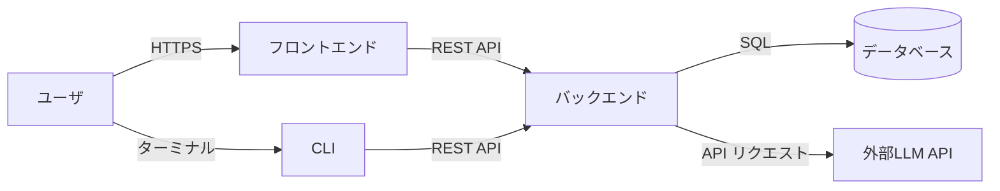
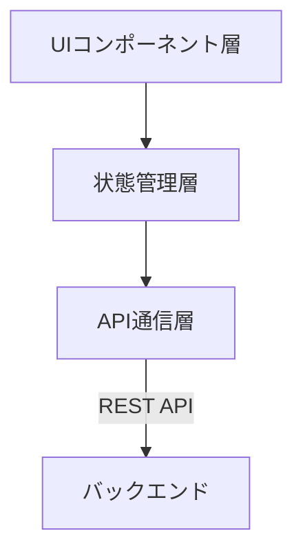
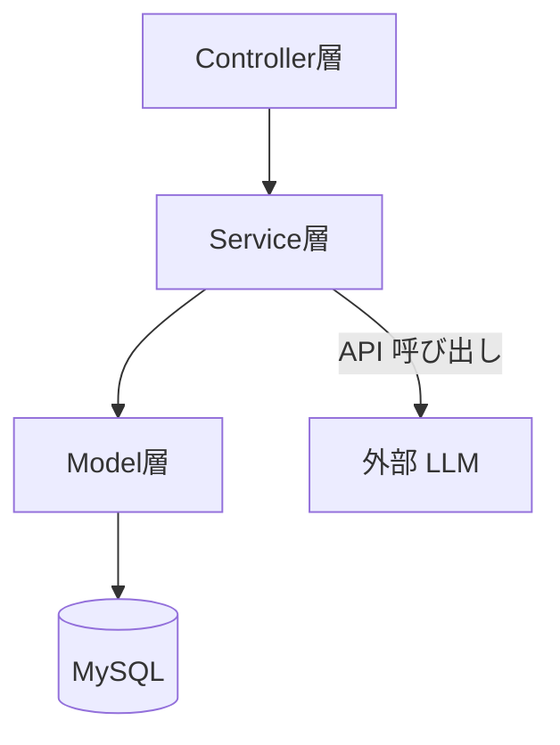
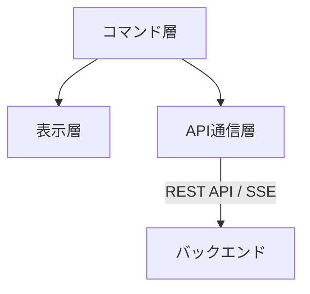
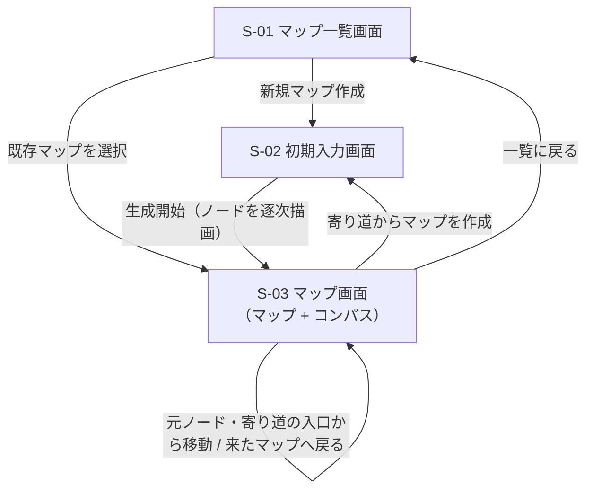
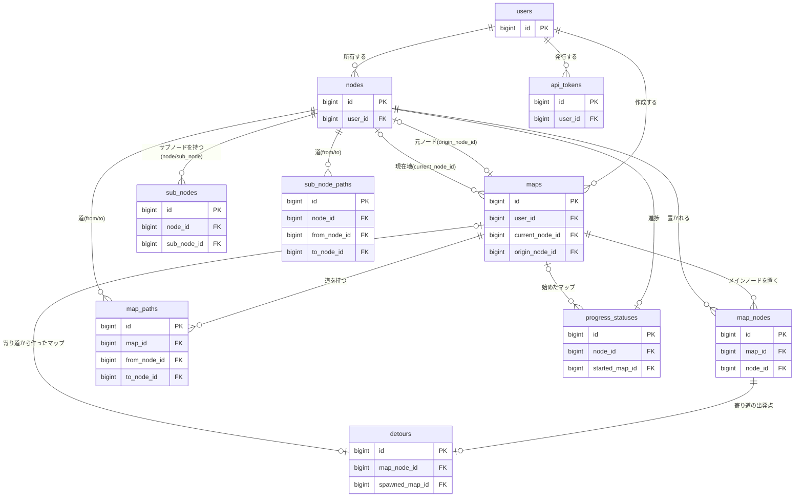

# 基本設計書：Campass

## 1. 文書概要

### 1.1 本書の位置づけ

本書は，「要件定義書（ReqDef.md）」に定義された機能要件・非機能要件を実現するための基本設計を定めるものである．
システム全体のアーキテクチャ，画面設計，データベース設計，および外部インターフェース（LLM API連携）設計について記載する．

### 1.2 改訂履歴

| バージョン | 日付 | 概要 | 変更者 |
| :--- | :--- | :--- | :--- |
| v1.0.0 | 2026/07/13 | 新規作成 | 池田 琉俊 |
| v1.1.0 | 2026/10/06 | 星座型ビューを「学習マップ」に改称し，コンパス（F-013）を画面設計に追加 | 池田 琉俊 |
| v1.2.0 | 2026/10/06 | 一本道ビューを廃止し，S-03 を学習マップのみの画面に変更．syllabus_nodes の order_index を廃止し importance_score を追加 | 池田 琉俊 |
| v1.3.0 | 2026/10/06 | 4章を概要（ER図・テーブル一覧）のみとし，カラム定義は Design Doc 4.1.2 を正とする形に変更（`syllabus_edges`，`progress_statuses`，アセスメント関連テーブルを ER図に追加）．5.1 のストリーミング方式を SSE に統一 | 池田 琉俊 |
| v1.4.0 | 2026/10/06 | CLI クライアント（F-014）を追加．2.1 の全体構成に CLI を追加し，2.4 CLI構成，3.5 CLIコマンド一覧を新設．認証トークン用の `api_tokens` を ER図・テーブル一覧に追加 | 池田 琉俊 |
| v1.5.0 | 2026/10/08 | 用語を GLOSSARY.md に合わせて整理（ノートブック・学習マップ・シラバスを「マップ」に統一）．ノードをユーザーの持ち物としてマップ間で共有する構成に合わせ，画面一覧・遷移図・URL，CLIコマンド，ER図・テーブル一覧を更新．クロスノートブックリンクと Embedding API 連携（5.2）を廃止 | 池田 琉俊 |
| v1.6.0 | 2026/10/09 | 前提知識アセスメント（ReqDef F-004）の廃止に合わせ，CLI構成（2.4），画面一覧（3.1），CLIコマンド一覧（3.5），ER図・テーブル一覧（4章），マップ生成API連携（5.1）からアセスメントを削除 | 池田 琉俊 |

---

## 2. システム構成

### 2.1 全体構成

| サブシステム | 役割 |
| :--- | :--- |
| フロントエンド | React によるSPA．マップ（コンパス付き）などのUIを担当． |
| CLI | Go によるコマンドラインクライアント（F-014）．フロントエンドと同じバックエンドAPIを利用し，業務ロジックとAPIキーを持たない． |
| バックエンド | Ruby on Rails によるAPIサーバー．LLM APIキーの秘匿管理，マップのデータの生成・永続化を担当． |
| データベース | MySQL．マップ，ノード，ユーザー進捗等を永続保持． |
| 外部LLM API | マップのデータ（JSON）の動的生成を担当．APIキーはバックエンドのみで保持し，フロントエンドには露出させない． |

以降の2.2〜2.4では，上記サブシステムのうち「フロントエンド」「バックエンド」「CLI」それぞれの内部レイヤー構成を示す．

### 2.2 フロントエンド構成

| レイヤー | 役割 |
| :--- | :--- |
| UIコンポーネント層 | 画面表示・ユーザー操作の受付．マップ一覧，初期入力，マップ画面等の各画面を構成する． |
| 状態管理層 | 画面をまたいで参照するアプリケーション状態（現在のマップ，ノード等）を保持・更新する． |
| API通信層 | バックエンド API へのリクエスト送信，およびストリーミングレスポンス（マップの逐次生成）の受信を担当する． |

### 2.3 バックエンド構成

| レイヤ | 役割 |
| :--- | :--- |
| Controller層 | フロントエンドからのAPIリクエストを受け付け，レスポンス（通常/ストリーミング）を返却する． |
| Service層 | マップ生成・コンパスの導出等のビジネスロジックを担当し，外部LLM APIとの連携を行う． |
| Model層 | ActiveRecordを通じてMySQLとのデータ入出力を担当する． |

### 2.4 CLI構成

| レイヤー | 役割 |
| :--- | :--- |
| コマンド層 | サブコマンドと引数の解析，および対話入力（ゴール候補の選択，難易度の選択等）を担当する． |
| API通信層 | バックエンド API へのリクエスト送信（認証トークンの付与を含む），およびストリーミングレスポンス（マップの逐次生成）の受信を担当する． |
| 表示層 | バックエンドから受け取ったマップ・コンパス・ノード詳細をターミナル向けのテキストとして出力する．コンパスなどの導出は行わない． |

* CLI は Go の標準ライブラリのみで実装し，外部パッケージに依存しない．詳細は Design Doc 4.5 を参照する．

---

## 3. 画面設計

### 3.1 画面一覧

| 画面ID | 画面名 | URL | 概要 | 関連機能ID |
| :--- | :--- | :--- | :--- | :--- |
| S-01 | マップ一覧画面 | `/maps` | ユーザーが保持する複数のマップを平らに一覧表示し，新規作成・選択を行う．元ノードや寄り道から作ったマップには「Ruby の『オブジェクト指向』から」のような注記を付ける． | F-012 |
| S-02 | 初期入力画面 | `/maps/new` | 興味・ゴールの入力，ゴール候補の選択，難易度選択を行う．寄り道から作る場合は寄り道のテーマを興味として入力済みにする． | F-001〜F-003，F-006 |
| S-03 | マップ画面 | `/maps/:mapId`（ノード選択中は `?node=:nodeId`） | メインノードと道をネットワーク図として可視化し，現在地と，コンパスで今進める場所を指し示す．ノードを選ぶと詳細パネル（概要，進捗，寄り道，登場する他のマップ）を開き，サブノードをドリルダウン展開する．元ノードや作成済みの寄り道からは別のマップへ移動できる． | F-006，F-007，F-009，F-010，F-013，F-015，非機能要件5.2 |

### 3.2 画面項目定義

### 3.3 画面遷移図

### 3.4 ワイヤーフレーム

### 3.5 CLIコマンド一覧

CLI（F-014）は画面を持たないため，各画面に相当する操作をサブコマンドとして提供する．引数・出力形式の詳細は Design Doc 4.5 を参照する．

| コマンド | 概要 | 対応する画面 | 関連機能ID |
| :--- | :--- | :--- | :--- |
| `campass login` / `campass logout` | 認証トークンの取得・破棄 | — | — |
| `campass maps` | マップ一覧の表示 | S-01 | F-012 |
| `campass new` | 興味の入力からマップ生成までを対話形式で行う．生成されたノードを1件ずつ表示する | S-02 | F-001〜F-003，F-011 |
| `campass map <map_id>` | マップ（メインノードと道）とコンパスの表示 | S-03 | F-006，F-013 |
| `campass show <map_id> <node_id>` | ノードの詳細（概要，進捗，このマップでの寄り道，登場する他のマップ）とサブノード（ドリルダウン）の表示 | S-03 | F-007，F-015 |
| `campass start <map_id> <node_id>` / `campass done <map_id> <node_id>` | 指定したマップでの進捗の更新と，更新後のコンパスの表示 | S-03 | F-010，F-013 |

---

## 4. データベース設計

本章ではテーブル間の関係の概要のみを示す．カラム・型・制約の定義は Design Doc（`design_doc.md`）4.1.2 を正とし，本書では重複して定義しない．

### 4.1 ER図

主キー・外部キーのみを示す．

### 4.2 テーブル一覧

| テーブル | 役割 | 関連機能 |
| :--- | :--- | :--- |
| `users` | ユーザー情報と認証 | — |
| `api_tokens` | CLI 用の認証トークン（ハッシュ値のみ保持） | F-014 |
| `maps` | ゴールごとの作業スペース．ゴール・難易度・生成状態・現在地・元ノードを持つ | F-001〜F-003，F-012，F-013，F-017 |
| `nodes` | ノードの内容（タイトル・概要）．ユーザーの持ち物で，複数のマップに登場できる | F-011，F-015 |
| `map_nodes` | マップに置かれたメインノードと，そのマップでの重要度 | F-011，F-013，F-015 |
| `map_paths` | マップごとのメインノード間の道 | F-011，F-013 |
| `sub_nodes` | ノードとそのサブノードの関係（マップ間で共有） | F-007，F-016 |
| `sub_node_paths` | 同じノードの中のサブノード間の道（マップ間で共有） | F-007 |
| `detours` | メインノードごとの寄り道と，そこから作ったマップ | F-006 |
| `progress_statuses` | ノードごとの進捗（マップ間で共有）と，学習を始めたマップ | F-010，F-013，F-015 |

---

## 5. 外部インターフェース設計

### 5.1 マップ生成API連携

* ユーザーが確定した「ゴール」「難易度」と，ユーザーの既存ノードの一覧を基に，バックエンドが外部LLM APIへプロンプトを送信し，構造化されたマップのデータ（JSON）を生成する．同じ内容のノードは新しく作らずに既存ノードを再利用させる．
* マップ生成には数十秒を要する可能性があるため，**ストリーミング形式**でLLMのレスポンスを逐次受信し，生成されたノードから順にフロントエンドへ反映する．
* バックエンドはストリーミングされたチャンクを解析し，ノード1件分のJSONが確定するたびに SSE（Server-Sent Events）でフロントエンドへ逐次配信する（Design Doc 4.3.2）．

### 5.2 Embedding API連携（v1.5.0 で廃止）

* クロスノートブックリンクの提案のために使っていたが，ノードをマップ間で共有する構成（ADR 0003）に変えたため廃止した．

### 5.3 APIキー管理方式

* 外部LLM APIのキーは環境変数等によりバックエンド（Rails）側でのみ保持し，フロントエンドおよびCLIへは一切露出させない．
* フロントエンドおよびCLIから外部APIへの直接リクエストは行わず，必ずバックエンドを経由する構成とする．

### 5.4 オプトアウト設定

* 外部LLM APIへのリクエスト時には，送信データをAIモデルの学習に利用しない設定（オプトアウト）を必須パラメータとしてリクエストに含める．
* ユーザーの自由記述入力（ゴール入力等）に個人情報・秘密情報が含まれた場合の漏洩リスクを低減する．
